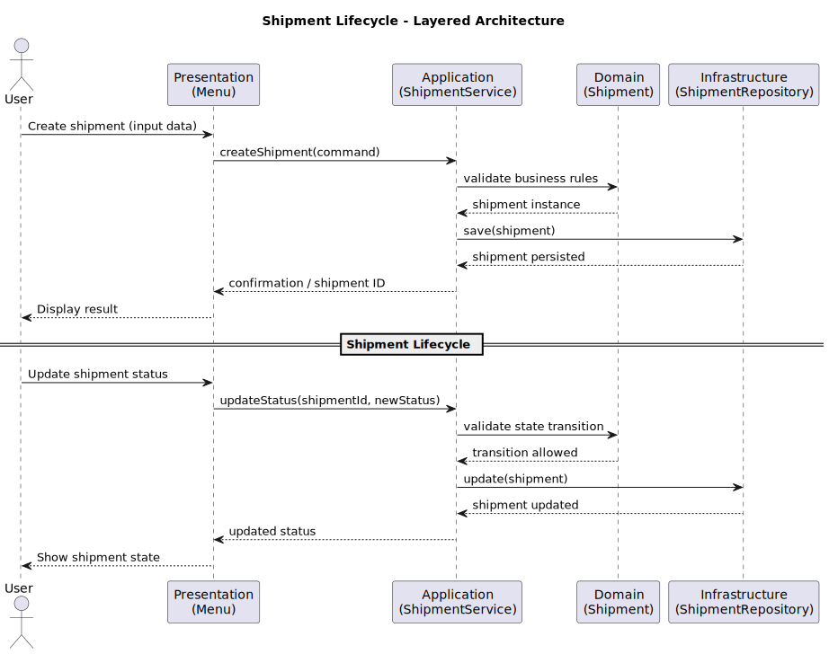
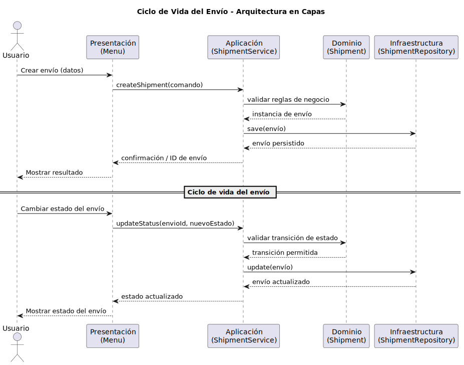

<div align="center">
  <h2 align="center">Expedition and Shipment Management System</h2>
  
</div>

<p align="center">
  <strong>Choose language / Elige idioma</strong><br><br>
  <a href="#english" style="text-decoration: none; margin-right: 30px;">
     
    <span style="vertical-align: middle;">English</span>
  </a>
  <a href="#español" style="text-decoration: none;">
     
    <span style="vertical-align: middle;">Español</span>
  </a>
</p>

---

## 📑 Table of Contents / Índice

- [English](#project-expedition-and-shipment-management-system-logistics)
  - [General Description](#en-description)
  - [Objectives](#en-objectives)
  - [Main Domain Entities](#en-entities)
  - [Project Scope](#en-scope)
  - [Architecture](#en-architecture)
  - [Shipment Lifecycle (UML)](#en-uml)
  - [Project Structure](#en-structure)

- [Español](#proyecto-sistema-de-gestión-de-expediciones-y-envíos-logística)
  - [Descripción general](#es-descripcion)
  - [Objetivos](#es-objetivos)
  - [Entidades principales del dominio](#es-entidades)
  - [Alcance del proyecto](#es-alcance)
  - [Arquitectura](#es-arquitectura)
  - [Ciclo de Vida del Envío (UML)](#es-uml)
  - [Estructura del proyecto](#es-estructura)

---

<details open id="english">
<summary>🇬🇧 English</summary>

### <span id="project-expedition-and-shipment-management-system-logistics"></span> PROJECT: Expedition and Shipment Management System (Logistics)

<hr>

### <span id="en-description"></span> 📖 General Description

This project consists of the design and development of a system for the comprehensive management of shipments and parcel logistics, focused on warehouse control, goods classification, and tracking the lifecycle of expeditions.

The system models a logistics network composed of distribution centers where packages are received, classified, and dispatched. Each shipment is managed according to its nature and urgency, which determines its priority, the assigned transport type, and the validation rules applied at each state.

Additionally, the system ensures full traceability of each package, from its registration at the origin warehouse to the confirmation of its final delivery, guaranteeing that only coherent state transitions are allowed and that safety and handling restrictions specific to each type of cargo are respected.

The proposal focuses on describing the behavior and rules of the logistics domain, without delving into technical details or implementation decisions, so that the design remains independent of the underlying technology.

<hr>

### <span id="en-objectives"></span> 🎯 Objectives

* **General Objective**
To develop a modular and extensible system that allows coherent management of the logistics flow of expeditions and inventory control in distribution centers.

* **Specific Objectives**
  * Manage different types of shipments with differentiated transport rules and priorities using inheritance and polymorphism.
  * Control the states of expeditions, ensuring a logical and traceable workflow.
  * Model the infrastructure of logistics centers and their storage capacity.
  * Implement business validations that prevent incoherent operations (e.g., delivering a shipment that has not been dispatched).

<hr>

### <span id="en-entities"></span> 🧩 Main Domain Entities

The system is structured around several core domain entities, most notably the **Shipment**, **Logistic Center**, and **Transport Route**, which collaborate to manage the complete lifecycle of an expedition, from registration to final delivery.

#### 🏭 Logistic Centers and Storage

* The system allows registering distribution centers with data such as unique identifier, location, and operational capacity.
* Each center maintains a record of the packages physically stored at its facilities.
* The current load of a center can be queried to determine whether it can receive new expeditions.

#### 📦 Shipment Types (Class Hierarchy)

The system manages a base shipment class from which at least three specialized types inherit, each with its own behavior:

* **Standard Shipment**: Follows conventional routes and has a base priority.
* **Express Shipment**: Includes a Guaranteed Delivery Time attribute. Its priority logic is higher and it has time constraints at each state.
* **Fragile / Special Shipment**: Includes handling protocols (e.g., Do not stack) and requires additional Cargo Insurance validation before being dispatched.

Through polymorphism, each shipment type implements its own methods to `calculateLogisticCost()` and `validateDispatchRequirements()`.

#### 🔄 Lifecycle and State Management

Expeditions must pass through strict states to ensure consistency:

* **Registered**: The shipment exists in the system but has not yet arrived at the warehouse.
* **In Warehouse (Origin)**: Received and classified, ready for transit.
* **In Transit**: Assigned to a transport route.
* **Out for Delivery (Destination)**: Final stage before delivery.
* **Delivered**: Successful completion of the lifecycle.
* **Incident / Held**: Special state in case of issues (incorrect address, damage, etc.).

The system prevents invalid transitions to ensure process consistency.

#### 🚚 Logistics Operations

* **Route Assignment**: Link one or more shipments to a transport manifest.
* **State Update**: Change the status of a shipment while validating that the transition is allowed (e.g., a shipment cannot move directly from Registered to Out for Delivery).
* **Load Management**: Register the entry and exit of packages in distribution centers to keep inventory synchronized.

#### 🔍 Available Actions and Queries

* Registering new expeditions by defining sender, recipient, shipment type, and destination.
* Consulting the complete state history (traceability) of a tracking code.
* Listing all packages currently stored in a specific logistics center.
* Mass-updating the state of shipments assigned to a transport route.
* Generating a performance report (delivered shipments vs. shipments with incidents).

<hr>

### <span id="en-scope"></span> 📌 Project Scope

#### Included

* Class modeling for Centers, Shipments (with hierarchy), Routes, and Users (Operators).
* Business logic for cost calculation and priority management based on shipment type.
* State validation system to prevent impossible transitions.
* Management of the current location of each package within the network.

#### Not Included

* Integration with external map or GPS APIs for real-time tracking.
* Real payment gateways for shipment costs.
* Vehicle fleet management (truck maintenance, fuel consumption).
* Complex user interfaces (focuses on domain logic and console interaction).

<hr>

### <span id="en-architecture"></span> 🧱 Architecture

* **Presentation**: Console-based user interface.
* **Application**: Use cases and orchestration of business logic.
* **Domain**: Business models and rules.
* **Infrastructure**: Technical persistence implementations.

<hr>

### <span id="en-uml"></span> 📊 Shipment Lifecycle (UML)

<div align="center">
    
</div>

<hr>

### <span id="en-structure"></span> 📂 Project Structure

```
📦logisticaEnvios
 ┣ 📜__init__.py
 ┣ 📜main.py                     # Application entry point; initializes repositories, services, and starts the interface.
 ┣ 📂presentation
 ┃ ┣ 📜__init__.py
 ┃ ┗ 📜menu.py                   # Console-based interface that allows users to interact with the system.
 ┣ 📂application
 ┃ ┣ 📜__init__.py
 ┃ ┣ 📜center_service.py         # Contains application logic for managing logistic centers.
 ┃ ┣ 📜route_service.py          # Manages the creation, assignment, and execution of transport routes.
 ┃ ┗ 📜shipment_service.py       # Coordinates high-level operations related to shipments.
 ┣ 📂domain
 ┃ ┣ 📜__init__.py
 ┃ ┣ 📜center_repository.py      # Defines the contract (interface) for logistic center repositories.
 ┃ ┣ 📜logistic_center.py        # Domain model representing a logistic center and its inventory.
 ┃ ┣ 📜route.py                  # Domain model representing a transport route.
 ┃ ┣ 📜route_repository.py       # Contract for route persistence and access.
 ┃ ┣ 📜shipment.py               # Base class that models a shipment and its lifecycle.
 ┃ ┣ 📜shipment_repository.py    # Contract for shipment repositories.
 ┃ ┗ 📜shipment_types.py         # Implements different shipment types using inheritance and polymorphism.
 ┣ 📂infrastructure
 ┃ ┣ 📜__init__.py
 ┃ ┣ 📜memory_center.py          # In-memory implementation of the center repository.
 ┃ ┣ 📜memory_route.py           # In-memory implementation of the route repository.
 ┃ ┣ 📜memory_shipment.py        # In-memory implementation of the shipment repository.
 ┃ ┣ 📜seed_data.py              # Loads initial data for testing and demonstration.
 ┗ 📂docs
   ┗ 📂images                    # Diagrams and visual documentation used in the README
```
</details>

<details open id="español">
<summary>🇪🇸 Español</summary>

### <span id="proyecto-sistema-de-gestión-de-expediciones-y-envíos-logística"></span> PROYECTO: Sistema de Gestión de Expediciones y Envíos (Logística)

<hr>

### <span id="es-descripcion"></span> 📖 Descripción general

El proyecto consiste en el diseño y desarrollo de un sistema para la gestión integral de envíos y logística de paquetería, orientado al control de almacenes, la clasificación de mercancías y el seguimiento del ciclo de vida de las expediciones.
El sistema modela una red logística compuesta por centros de distribución donde se reciben, clasifican y despachan paquetes. Cada envío se gestiona según su naturaleza y urgencia, lo que condiciona su prioridad, el tipo de transporte asignado y las reglas de validación en cada estado.
Asimismo, el sistema asegura la trazabilidad total de cada bulto, desde que se registra en el almacén de origen hasta que se confirma su entrega final, garantizando que solo se realicen transiciones de estado coherentes y que se respeten las restricciones de seguridad y manejo de cada tipo de carga.

La propuesta se centra en describir el comportamiento y las reglas del dominio logístico, sin entrar en detalles técnicos ni decisiones de implementación, de forma que el diseño sea independiente de la tecnología utilizada.

<hr>

### <span id="es-objetivos"></span> 🎯 Objetivos

* **Objetivo general**
  Desarrollar un sistema modular y extensible que permita gestionar de forma coherente el flujo logístico de expediciones y el control de inventario en centros de distribución.

* **Objetivos específicos**

  * Gestionar diferentes tipos de envíos con reglas de transporte y prioridades diferenciadas mediante herencia y polimorfismo.
  * Controlar los estados de las expediciones garantizando un flujo lógico y trazable.
  * Modelar la infraestructura de centros logísticos y su capacidad de almacenamiento.
  * Implementar validaciones de negocio que impidan operaciones incoherentes (ej. entregar un paquete no enviado).

<hr>

### <span id="es-entidades"></span> 🧩 Entidades principales del dominio

El sistema se articula en torno a varias entidades principales del dominio, entre las que destacan el **Envío**, el **Centro Logístico** y la **Ruta de Transporte**, las cuales colaboran entre sí para gestionar el ciclo completo de una expedición, desde su registro hasta su entrega final.

#### 🏭 Centros Logísticos y Almacenamiento

* El sistema permitirá registrar centros de distribución con datos como código identificador, ubicación y capacidad operativa.
* Cada centro mantiene un registro de los paquetes que se encuentran físicamente en sus instalaciones.
* Se podrá consultar el volumen de carga actual de un centro para determinar si puede recibir nuevas expediciones.

#### 📦 Tipología de Envíos (Jerarquía de Clases)

El sistema gestionará una clase base de la que heredarán al menos tres tipos especializados, cada uno con comportamiento propio:

  * **Envío Estándar**: Sigue rutas convencionales y tiene una prioridad base.
  * **Envío Exprés**: Posee un atributo de "Tiempo de Entrega Garantizado". Su lógica de prioridad es superior y tiene restricciones de tiempo en cada estado.
  * **Envío Frágil/Especial**: Incluye protocolos de manejo (ej. "No apilar") y requiere una validación adicional de "Seguro de Carga" antes de ser despachado.

Mediante polimorfismo, cada tipo de envío implementará su propio método para `calcularCosteLogistico()` y `validarRequisitosDespacho()`.

#### 🔄 Ciclo de Vida y Gestión de Estados

Las expediciones deben pasar por estados estrictos para asegurar la coherencia:

* **Registrado**: El paquete está en el sistema, pero no ha llegado al almacén.
* **En Almacén (Origen)**: Recibido y clasificado, listo para tránsito.
* **En Tránsito**: Asignado a una ruta de transporte.
* **En Reparto (Destino)**: En el último tramo para la entrega.
* **Entregado**: Finalización exitosa del ciclo.
* **Incidencia/Retenido**: Estado especial ante problemas (dirección incorrecta, rotura, etc.).

El sistema impide transiciones inválidas para garantizar la coherencia del proceso.

#### 🚚 Operaciones de Logística

* **Asignación de Rutas**: Vincular uno o varios envíos a un manifiesto de transporte.
* **Actualización de Estado**: Cambiar la situación de un envío validando que el cambio es permitido (ej. no se puede pasar de "Registrado" a "En Reparto" directamente).
* **Gestión de Carga**: Registrar la entrada y salida de bultos en los centros de distribución para mantener el inventario sincronizado.

#### 🔍 Acciones y consultas disponibles

Los operadores logísticos interactúan con el sistema para registrar, consultar y actualizar la información de las expediciones y centros de distribución. El sistema permitirá realizar, entre otras, las siguientes acciones:

* Registrar nuevas expediciones definiendo remitente, destinatario, tipo de bulto y destino.
* Consultar el historial completo de estados (trazabilidad) de un código de seguimiento.
* Listar todos los paquetes que se encuentran actualmente en un centro logístico específico.
* Cambiar masivamente el estado de paquetes asignados a una ruta de transporte.
* Generar un informe de rendimiento (envíos entregados vs. envíos con incidencia).

<hr>

### <span id="es-alcance"></span> 📌 Alcance del proyecto

#### Incluye

* Modelado de clases para Centros, Envíos (con su jerarquía), Rutas y Usuarios (Operadores).
* Lógica de negocio para el cálculo de costes y prioridades según el tipo de envío.
* Sistema de validación de estados para evitar transiciones imposibles.
* Gestión de la ubicación actual de cada paquete en la red.

#### No incluye

* Integración con APIs externas de mapas o GPS para seguimiento en tiempo real.
* Pasarela de pagos real para los costes de envío.
* Gestión de flota vehicular (mantenimiento de camiones, consumo de combustible).
* Interfaz de usuario compleja (se centra en la lógica de dominio y consola).

Este alcance permite desarrollar un sistema coherente y completo a nivel de lógica de negocio, manteniendo una complejidad adecuada al nivel del curso.

<hr>

### <span id="es-arquitectura"></span> 🧱 Arquitectura

El proyecto sigue una arquitectura en capas:

* **Presentation**: Interfaz de usuario por consola.
* **Application**: Casos de uso y orquestación de la lógica.
* **Domain**: Modelos y reglas del negocio.
* **Infrastructure**: Implementaciones técnicas de persistencia.

Esta separación facilita la mantenibilidad, la escalabilidad y la evolución del sistema.

<hr>

### <span id="es-uml"></span> 📊 Ciclo de Vida del Envío (UML)

El siguiente diagrama de secuencia muestra cómo fluye una operación de envío a través de las distintas capas del sistema, desde la interacción del usuario hasta la persistencia.

<div align="center">
    
</div>

<hr>

### <span id="es-estructura"></span> 📂 Estructura del proyecto

```
📦logisticaEnvios
 ┣ 📜__init__.py
 ┣ 📜main.py                     # Punto de entrada de la aplicación; inicializa repositorios, servicios y lanza la interfaz.
 ┣ 📂presentation
 ┃ ┣ 📜__init__.py
 ┃ ┗ 📜menu.py                   # Interfaz por consola que permite al usuario interactuar con el sistema.
 ┣ 📂application
 ┃ ┣ 📜__init__.py
 ┃ ┣ 📜center_service.py         # Contiene la lógica de aplicación para gestionar centros logísticos.
 ┃ ┣ 📜route_service.py          # Gestiona la creación, asignación y ejecución de rutas de transporte.
 ┃ ┗ 📜shipment_service.py       # Coordina las operaciones de alto nivel relacionadas con los envíos.
 ┣ 📂domain
 ┃ ┣ 📜__init__.py
 ┃ ┣ 📜center_repository.py      # Define el contrato (interfaz) para repositorios de centros logísticos.
 ┃ ┣ 📜logistic_center.py        # Modelo de dominio que representa un centro logístico y su inventario.
 ┃ ┣ 📜route.py                  # Modelo de dominio que representa una ruta de transporte.
 ┃ ┣ 📜route_repository.py       # Contrato para el acceso y persistencia de rutas.
 ┃ ┣ 📜shipment.py               # Clase base que modela un envío y su ciclo de vida.
 ┃ ┣ 📜shipment_repository.py    # Contrato para repositorios de envíos.
 ┃ ┗ 📜shipment_types.py         # Implementa los distintos tipos de envíos usando herencia y polimorfismo.
 ┣ 📂infrastructure
 ┃ ┣ 📜__init__.py
 ┃ ┣ 📜memory_center.py          # Implementación en memoria del repositorio de centros.
 ┃ ┣ 📜memory_route.py           # Implementación en memoria del repositorio de rutas.
 ┃ ┣ 📜memory_shipment.py        # Implementación en memoria del repositorio de envíos.
 ┃ ┣ 📜seed_data.py              # Carga datos iniciales para pruebas y demostración.
 ┗ 📂docs
   ┗ 📂images                    # Diagramas y documentación visual utilizada en el README
```
</details>

---

### ✒️ Author 
* **Echedey Henríquez Hernández** - *Initial Work* - [EchedeyHenr](https://github.com/EchedeyHenr)

---

⌨️ with ❤️ by [EchedeyHenr](https://github.com/EchedeyHenr)